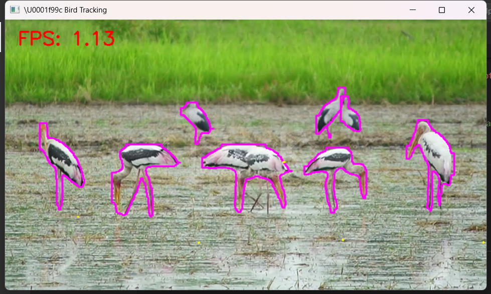
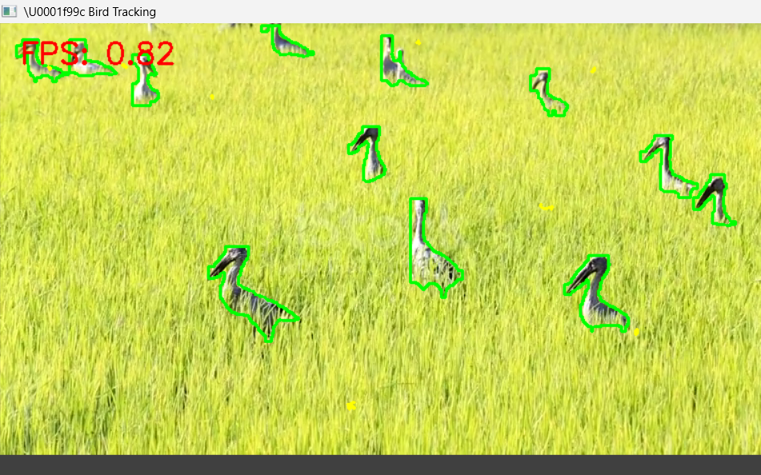
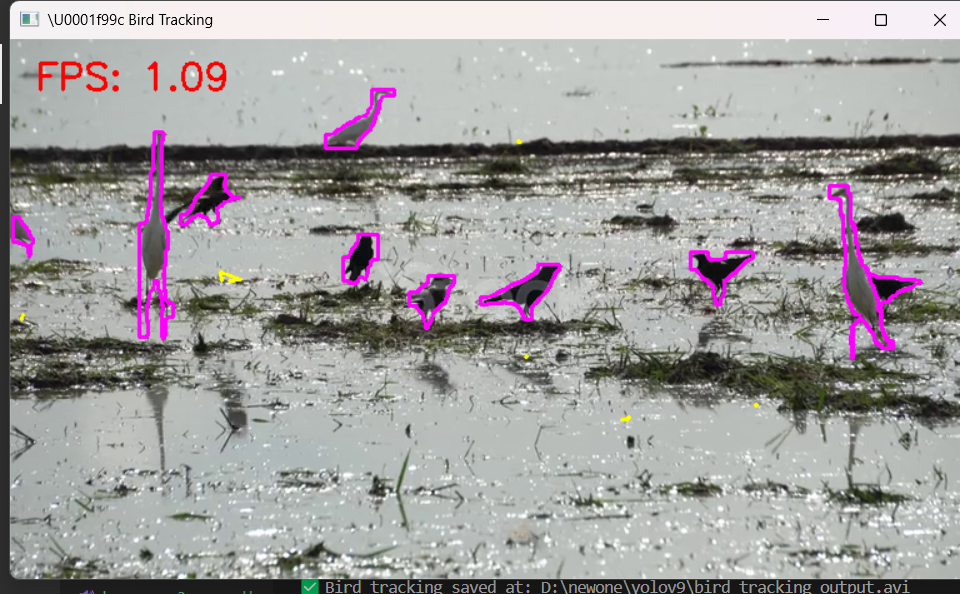

# 🐦 Bird Detection and Tracking using YOLOv9 and DeepSORT

This project is a real-time bird detection and tracking system built to monitor agricultural fields. It uses **YOLOv9** for object detection and **DeepSORT** for multi-object tracking.

---

## 📌 Project Overview

Birds can cause significant damage to crops. This system helps automate monitoring using computer vision—detecting and tracking birds in real-time to assist in agricultural protection.

---

## 🚀 Features

- Real-time object detection with YOLOv9
- Accurate tracking using DeepSORT
- FPS overlay to monitor performance
- OpenCV-powered video streaming and annotation
- Extendable for other animals or objects

---

## 🛠️ Tech Stack

- Python 3.10+
- OpenCV
- PyTorch
- Ultralytics YOLOv9
- DeepSORT Realtime
- VS Code

---

## 📁 Folder Structure

```
finalproject/
├── ip1bird.py                # Main detection and tracking script
├── yolov9c-seg.pt            # Pretrained YOLOv9 model file
├── buzzer.mp3                # Optional buzzer alert
├── *.mp4 / *.jpg             # Input video/images
├── requirements.txt
└── README.md
```

---

## 🧑‍💻 How to Run

1. **Clone this repository**:
   ```bash
   git clone https://github.com/yourusername/bird-tracking-yolov9.git
   cd bird-tracking-yolov9
   ```

2. **Install the dependencies**:
   ```bash
   pip install -r requirements.txt
   ```

3. **Make sure your YOLOv9 model is in the project folder**:  
   Place `yolov9c-seg.pt` inside the project directory.

4. **Run the script**:
   ```bash
   python ip1bird.py
   ```

> ⚠️ Make sure your webcam is connected (or replace `cv2.VideoCapture(0)` with a video file path if testing with a saved video).

---

## 📦 Requirements

Install all dependencies using:

```bash
pip install -r requirements.txt
```

Contents of `requirements.txt`:

```
ultralytics==8.0.203
deep_sort_realtime==1.3.1
opencv-python==4.8.0.76
torch==2.1.0
numpy
```

---

## 📸 Sample Output





---

## 👩‍💻 Contributors

- **Harini M** 
- **Divya dharshika S**  
- **Aishwarya L**
- **Amirtha Varshini N G**

---

## 📜 License

This project is for academic and educational use only.
